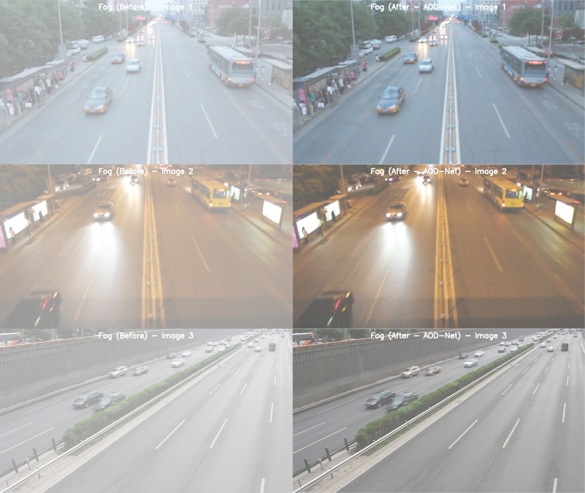
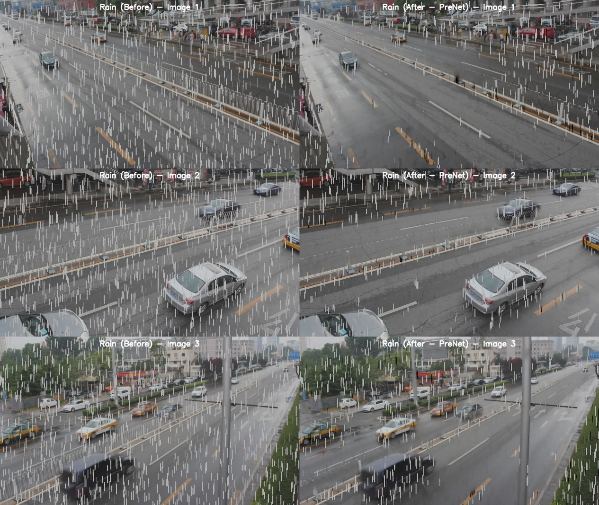
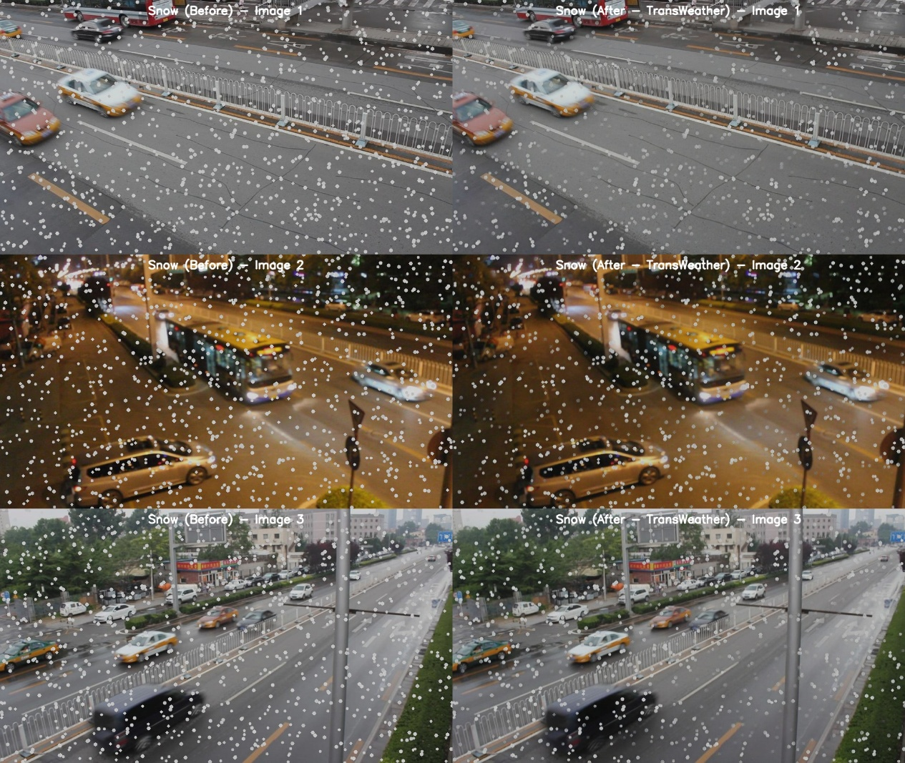
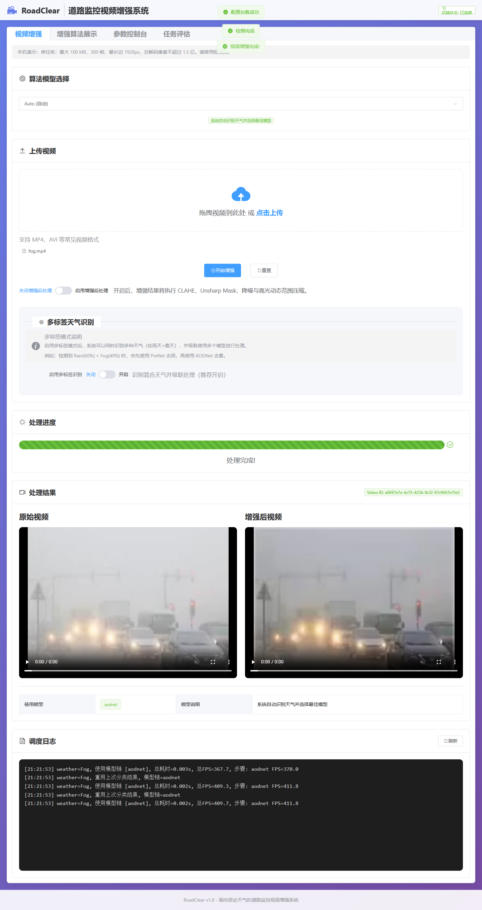
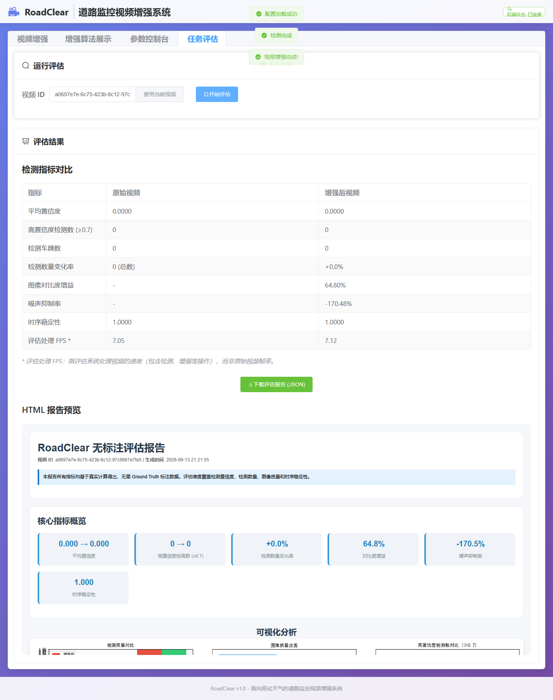

# RoadClear

### 天气感知道路视频增强系统 · Weather-aware Road Video Enhancement

RoadClear 是我的软件工程本科毕业设计：将天气识别、深度学习图像复原、视频处理和目标检测整合到交互式 Web 系统，探索雾、雨、雪条件下道路监控画面的增强及其对下游检测的影响。

RoadClear is my undergraduate Software Engineering capstone project. It integrates weather recognition, deep-learning image restoration, video processing, and object detection into an interactive web application, exploring enhancement of road surveillance footage under fog, rain, and snow and its effects on downstream detection.


## 项目目标 / Motivation

恶劣天气会遮挡道路细节，也可能影响车辆与车牌检测。项目不仅对比增强前后画面，还将结果送入检测与评估流程：看起来更清晰，不一定意味着检测更准确。

Adverse weather obscures road details and can affect vehicle and licence-plate detection. The project compares original and enhanced footage and evaluates downstream detection: clearer-looking images do not necessarily yield more accurate detections.

## 功能与技术 / Features and stack

| 模块 / Module | 内容 / Description |
| --- | --- |
| 天气识别 / Weather recognition | MobileNetV3 Small 分类与周期性调度 / Classification and periodic weather-based routing |
| 去雾 / Dehazing | AOD-Net：集成已有模型 / Integration of an existing model |
| 去雨 / Deraining | PReNet：集成已有模型 / Integration of an existing model |
| 去雪 / Desnowing | TransWeather：基于 Snow100K 自行训练专用权重 / Task-specific weights trained on Snow100K |
| 视频处理 / Video processing | OpenCV、FFmpeg：上传、逐帧增强、编码、预览、下载 / Upload, frame-wise enhancement, encoding, preview, download |
| 下游检测 / Downstream detection | YOLO 系列车辆与车牌检测、增强前后对比 / YOLO-based vehicle and licence-plate detection with before/after comparison |
| Web 系统 / Web application | Vue 3、Element Plus、FastAPI、REST API |
| 恢复版推理 / Recovered inference | PyTorch、ONNX Runtime，本地 CPU 流程 / Locally verified CPU workflow |

HDCWNet 曾用于去雪实验，但因视频效果不理想被弃用，最终采用 TransWeather。部分旧文件名仍含 `hdcwnet`，不代表最终使用该网络。

HDCWNet was explored but discarded because its video results were unsatisfactory. TransWeather is the final desnowing approach; legacy filenames containing `hdcwnet` do not identify the final model.

## 处理流程 / Processing pipeline

```text
上传视频 / Upload video
  → 解码与验证 / Decode and validate
  → 天气识别或手动选择 / Classify weather or select a model
  → AOD-Net (fog) / PReNet (rain) / TransWeather (snow)
  → 可选后处理 / Optional post-processing
  → 编码、对比与下载 / Encode, compare, and download
  → 车辆与车牌检测评估 / Vehicle and licence-plate evaluation
```

## 毕业设计实验 / Capstone experiments

以下为原毕业设计报告的实验结果，与恢复版的功能测试分开呈现。论文第 4.4 节使用 DETRAC 视频生成合成雨、雾、雪退化，每类随机选择 20 个片段，每段 5 秒、25 FPS，总计 7,500 帧。原始清晰视频与退化视频分别作为参考上界和比较基线。这些结果不能直接推广为真实天气视频或当前 ONNX 恢复版的性能保证。

The following results belong to the original capstone experiments, separately from the recovered application's functional tests. Thesis Section 4.4 describes synthetic rain, fog, and snow applied to DETRAC footage: 20 randomly selected clips per weather type, each lasting 5 seconds at 25 FPS, totalling 7,500 frames. Clean footage provides a reference upper bound, while degraded footage is the comparison baseline. These results do not guarantee performance on real weather footage or the current recovered ONNX implementation.

### 核心检测结果 / Selected detection results

| 天气与模型 / Weather and model | 指标 / Metric | 退化输入 / Degraded | 增强后 / Enhanced | 相对提升 / Relative gain |
| --- | --- | ---: | ---: | ---: |
| 雨 / Rain · PReNet | mAP@0.95 | 0.0736 | 0.1680 | +128.18% |
| 雾 / Fog · AOD-Net | 小目标召回率 / Small-object recall | 0.4667 | 0.6123 | +31.19% |
| 雪 / Snow · TransWeather | 高置信度检测数 / High-confidence detections | 596.4 | 650.1 | +9.01% |
| 雪 / Snow · TransWeather | 大目标召回率 / Large-object recall | 0.7646 | 0.8435 | +10.32% |

来源：论文第 4.4 节、表 4-12 与 4-13，答辩 PPT 第 18 页。提升百分比采用论文报告值，相对于退化输入计算，不是百分点。检测数量为实验汇总均值，因此可含小数；它不等同于检测准确率。

Sources: thesis Section 4.4, Tables 4-12 and 4-13, and defence slide 18. Gains are the reported relative changes from degraded inputs, not percentage-point changes. Detection counts are aggregated experimental averages and may be fractional; they are not detection accuracy.

天气分类在 DAWN 测试集上的雨天召回率，从单标签决策的 59.00% 提升到阈值式多天气推断的 75.50%，增加 **16.50 个百分点**。论文使用 0.3 概率阈值，可触发多个天气标签及串联增强；这里不将它描述为重新训练的独立多标签网络。

On the DAWN test set, rain recall increased from 59.00% with single-label decisions to 75.50% with threshold-based multi-weather inference, a gain of **16.50 percentage points**. The thesis uses a probability threshold of 0.3 to activate multiple weather labels and cascaded restoration; this does not imply a separately trained multi-label network. Source: thesis Tables 4-5 and 4-6.

### 原实验视觉对比 / Original experimental comparisons

以下图片直接取自答辩 PPT 第 19–20 页，左侧为退化输入，右侧为模型增强结果，属于历史实验素材，并非本次重新运行生成。

Images below were extracted directly from defence slides 19–20. Degraded inputs appear on the left and enhanced outputs on the right. They are historical experiment assets, not outputs generated during this documentation update.

<details>
<summary>雾 / Fog · AOD-Net</summary>



</details>

<details>
<summary>雨 / Rain · PReNet</summary>



</details>

<details>
<summary>雪 / Snow · TransWeather</summary>



</details>

实验也揭示了局限：图像质量代理指标与下游检测收益可能不一致；去雪对大目标的改善比小目标更明显。由此，评估需要结合有标注的检测指标，不能仅凭视觉效果或单一像素统计判断。

The experiments also highlight limitations: image-quality proxies may disagree with downstream detection gains, and desnowing benefits large objects more than small ones. Evaluation therefore needs labelled detection metrics rather than visual appearance or a single pixel statistic alone.

## 页面截图 / Application screenshots

### 视频增强 / Video enhancement

选择模型、上传视频、观察状态并对比处理结果。截图来自之前本地浏览器验证的短样例；日志中的 FPS 不是端到端性能基准。

Select a model, upload footage, inspect status, and compare outputs. This screenshot comes from earlier local browser validation using a short sample; logged FPS is not an end-to-end benchmark.



### 任务评估 / Task evaluation

对比检测统计与图像质量代理指标，导出 JSON 报告。截图中的零检测及其他数值只属于该演示输入，不是论文实验结果。

Compare detection statistics and image-quality proxies and export a JSON report. Zero detections and other values shown belong to this demonstration input, not the thesis experiments.



## 我的工作 / My contribution

- **系统设计与集成：** 将天气分类、复原、视频处理、检测与 Web 交互连接起来。  
  **System design and integration:** connected weather classification, restoration, video processing, detection, and web interaction.
- **模型实验与选择：** 比较去雪方案，弃用 HDCWNet，基于 Snow100K 训练并使用 TransWeather 专用权重。  
  **Experimentation and model selection:** evaluated desnowing candidates, rejected HDCWNet, and trained task-specific TransWeather weights on Snow100K.
- **应用开发与评估：** 实现前后端交互、结果对比和检测评估，后续恢复迁移项目并验证功能链路。  
  **Application development and evaluation:** implemented frontend/backend interaction, output comparison, and detection evaluation; later recovered the migrated project and validated its functional workflow.

本项目基于已有架构开展应用研究与工程集成，不声称原创 AOD-Net、PReNet、TransWeather 或 YOLO 架构。开发过程中借助了 AI 工具。

The project focuses on applied experimentation and engineering integration using existing architectures, not inventing AOD-Net, PReNet, TransWeather, or YOLO. AI tools assisted development.

## 运行与复现 / Running and reproduction

请先切换到复现分支。模型权重未提交 Git，也不会自动下载，仅克隆代码无法完成推理。

Switch to the reproduction branch first. Weights are excluded from Git and are not downloaded automatically; cloning alone is insufficient for inference.

```bash
git clone https://github.com/Acanddd/RoadClear.git
cd RoadClear
git switch archive/local-reproduction-20261008
```

按照[模型清单](https://github.com/Acanddd/RoadClear/blob/archive/local-reproduction-20261008/docs/model-manifest.json)补齐 `models/` 下六个文件并核对 SHA-256。运行环境：Windows、PowerShell 7、Python 3.12、Node.js ≥22.13、pnpm 11.19.0。

Supply the six files in `models/` and verify SHA-256 values against the [model manifest](https://github.com/Acanddd/RoadClear/blob/archive/local-reproduction-20261008/docs/model-manifest.json). Environment: Windows, PowerShell 7, Python 3.12, Node.js ≥22.13, pnpm 11.19.0.

```powershell
./scripts/setup.ps1
./scripts/check.ps1
./scripts/start.ps1
# Open http://127.0.0.1:5173
./scripts/stop.ps1
```

详细安装、API、配置与排错见[本地运行指南（中文）](https://github.com/Acanddd/RoadClear/blob/archive/local-reproduction-20261008/docs/LOCAL_SETUP.zh-CN.md)。

See the [local setup guide (Chinese)](https://github.com/Acanddd/RoadClear/blob/archive/local-reproduction-20261008/docs/LOCAL_SETUP.zh-CN.md) for detailed installation, APIs, configuration, and troubleshooting.


## 后续方向 / Future work

- PostgreSQL 保存任务与评估结果，任务队列支持后台处理和重试。  
  Persist jobs and evaluations in PostgreSQL; add background processing and retries through a job queue.
- 使用真实长视频与标注数据测量精度、时间一致性、延迟及资源占用。  
  Evaluate labelled, longer videos for accuracy, temporal consistency, latency, and resource usage.
- 验证 GPU/容器部署，补充自动化测试，优化前端资源体积。  
  Validate GPU/container deployment, expand automated tests, and reduce frontend bundle size.

## 文档与致谢 / Documentation and acknowledgements

[本科毕业论文 / Undergraduate thesis](https://github.com/Acanddd/RoadClear/blob/archive/local-reproduction-20261008/paper.pdf) · [项目学习指南 / Project study guide](https://github.com/Acanddd/RoadClear/blob/archive/local-reproduction-20261008/PROJECT_MASTERY_GUIDE.md)

感谢相关模型和数据集的原作者。模型、数据及第三方组件遵循各自许可和使用条件；本仓库不另行授予其使用权。

Acknowledgements to the original model and dataset authors. Models, data, and third-party components remain subject to their respective licences and usage conditions; this repository grants no additional rights to them.
